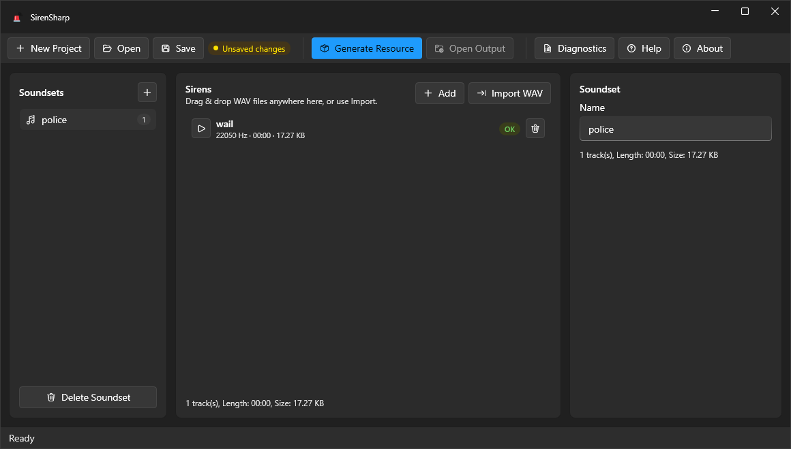

# 🔊 Creating AWC's

## What is an AWC?

An Audio Wave Container (AWC) is a file used by GTA 5 and FiveM to store `.wav`
files and play them at runtime. It's essentially a container holding your sounds
plus a bit of metadata about them.

In SirenSharp an AWC is called a **soundset** - one soundset becomes one `.awc`
in the generated pack.

## How do I create one?

In the **Soundsets** panel on the left, click the **+** (Add soundset) button. A new
soundset appears in the list. Select it and rename it in the inspector on the right;
the panel also shows how many sirens it holds.


Soundset names have a few rules - see [Naming Requirements](../info/naming-requirements.md).


<figure><figcaption>
The Soundsets panel (with the <strong>+</strong> button) on the left, a selected soundset, and its inspector on the right.
</figcaption></figure>
