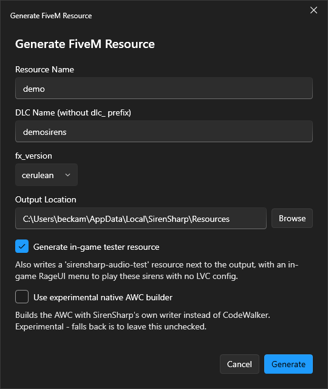

# 📂 Exporting Resource

When your project is ready, click **Generate Resource** in the toolbar.

<figure><figcaption><p>The Generate Resource dialog.</p></figcaption></figure>

Fill in:

* **Resource Name** - the FiveM resource folder name
* **DLC Name** - without the `dlc_` prefix; must be unique across your SirenSharp projects
* **fx_version** - default `cerulean` (change only if your server requires it)
* **Output location** - where the resource folder is written
* **Generate in-game tester** - also writes a `sirensharp-audio-test` resource (see [Test in-game](test-in-game.md))

SirenSharp generates:

```
your-resource/
  fxmanifest.lua
  SIRENSHARP_NOTES.txt
  data/
    {dlc}.dat54.rel
    {dlc}.dat54.nametable
  dlc_{dlc}/
    {soundset}.awc
```

After generation, use **Open Folder** or **RPF Explorer** (launches CodeWalker) to inspect the output before loading FiveM. To hear the sirens in-game, see [Test in-game](test-in-game.md).


Note the DLC name - you need it when configuring LVC Fleet VCF files.



The constraints that actually matter are each AWC's **size** (it has to fit a wave slot) and the **total** number of custom audio banks your whole server loads - not how many soundsets are in one project. See [Limits & Edge Cases](../info/limits-and-edge-cases.md).

